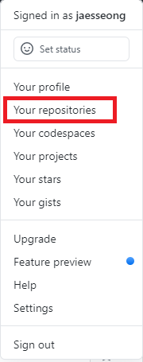
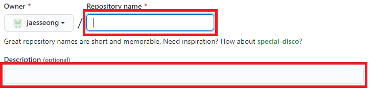
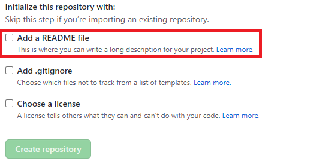
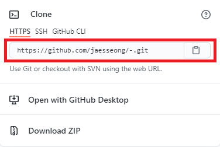

# [Github](github.com)

-----

## Github란?

깃허브<sup>Github</sup>는 분산 버전 컨트롤 소프트웨어 깃<sup>Git</sup>을 기반으로 소스 코드를 호스팅하고, 협업 지원 기능들을 지원하는 마이크로소프트<sup>Microsoft</sup>의 웹서비스

<p align="center">
    
</p>


## 원격 저장소와 로컬 저장소

깃<sup>Git</sup>은 원격 저장소와 로컬 저장소 두 종류의 저장소를 제공

- 원격 저장소<sup>Remote Repository</sup>: 파일이 원격 저장소 전용 서버에서 관리되며 여러 사람이 함께 공유하기 위한 저장소
- 로컬 저장소<sup>Local Repository</sup>: 내 PC에 파일이 저장되는 개인 전용 저장소


## 깃허브<sup>Github</sup> 튜토리얼

1. [깃<sup>Git</sup> 설치](https://git-scm.com/) + [깃허브<sup>Github</sup> 회원가입](https://github.com/)

2. 로그인 후 레파지토리<sup>repository</sup>(원격 저장소<sup>Remote Repository</sup>) 만들기
   1. 홈에서 오른 쪽 상단 자신의 프로필 클릭 </br><p align="center">  </p>
   2. your repositories 클릭 <br/><p align="center">  </p>
   3. New 클릭</br><p align="center">  </p>
   4. 레파지토리 이름 및 설명 작성</br><p align="center">  </p>
   5. Readme file 추가하기</br> <p align="center">  </p>
   6. 생성 완료

3. 로컬 저장소<sup>Local Repository</sup> 생성

   1. 원하는 곳에 폴더 생성

   2. Git Bash 실행

      1. 생성한 폴더로 이동

         ```
         cd 폴더명
         ```

      2. 메인 브렌치 명 변경

         ```
         git config --global init.defaultBranch main
         ```

      3. 폴더를 로컬 깃 저장소로 등록

         ```
         git init
         ```

      4. 사용자 정보 등록

         ```
         git config --global user.name "User Name"
         git config --global user.email useremail@example.com
         ```

      5. 원격 저장소<sup>Remote repository</sup> 연동

          1. 만든 원격 저장소에 들어가기

          2. Code 클릭

             <p align="center">
                 </p>

         	3. URL 복사

             <p align="center">
                 </p>

         	4. 원격 저장소 주소를 추가하는 코드 입력

         ```
         git remote add [저장소 명] [저장소 URL]
         git remote add origin "https://github.com/jaesseong/-.git"
         ```

      6. 원격 저장소에 있는 파일들 가져오기 ex) README.md

         ```
         git pull [저장소 명] [브렌치 명]
         git pull origin main
         ```

4. 로컬 저장소에 추가한 파일을 원격 저장소에 저장하기

   1. 로컬 저장소에 파일 또는 폴더 추가하기

   2. Git Bash 실행

   3. Index에 파일 추가

      ```
      # 모든 파일 추가
      git add .
      git add *
      # 특정 파일 추가
      git add [파일명 or 폴더명]
      ```

   4. 변경 사항을 기록하기

      ```
      git commit -m "설명"
      ```

   5. 원격 저장소에 저장하기

      ```
      git push [저장소 명] [브렌치 명]
      git push origin main
      ```

      **※ 멈춤 오류 발생시 해결 방법 (Window 환경)**

       1. cmd 실행

       2. 원격 저장소에 저장하는 코드 실행

          ```
          git add [파일명]
          git commit -m "설명"
          git push [저장소 명] [브렌치 명]
          ```

      	3. 인터넷 연걸 승인 및 개인 승인 토큰이 출력되면 **1**을 입력하고 Enter

      	4. 아이디 / 비밀번호 입력

      	5. 해결
