# Power BI Tutorial

# 목차

# Power BI 란?
관련없는 데이터 소스를 시각적으로 몰입도가 뛰어나고 일관된 대화형 정보로 변환하는 소프트웨어 서비스, 앱 및 커넥터의 컬렉션이다.

# Power BI 설치
  1. [Power BI](https://powerbi.microsoft.com/ko-kr/downloads/) 사이트 접속 
  2. Microsoft Power BI Desktop 설치

# Power BI 튜토리얼
  ## csv 데이터 가져오기 
  - [포스트 코로나 데이터](https://dacon.io/competitions/official/235618/overview/description) 다운로드 
    
    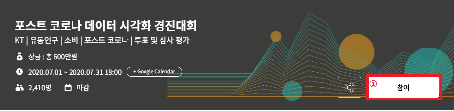
    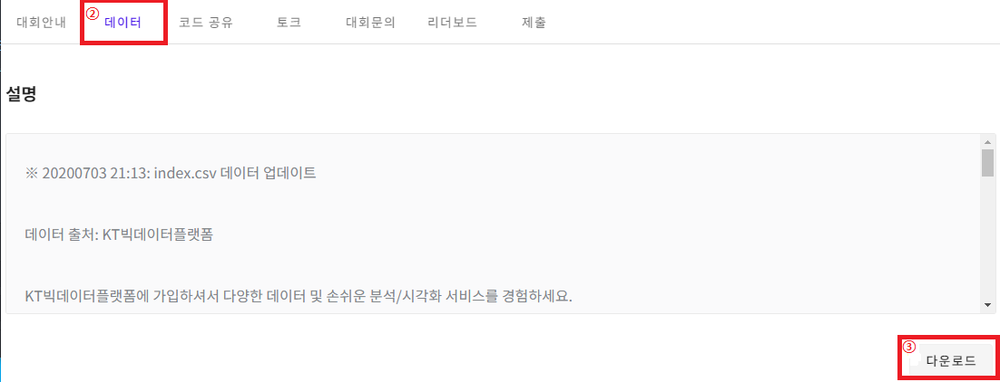
    
  
  - Power BI로 Index.csv 파일 불러오기
  
    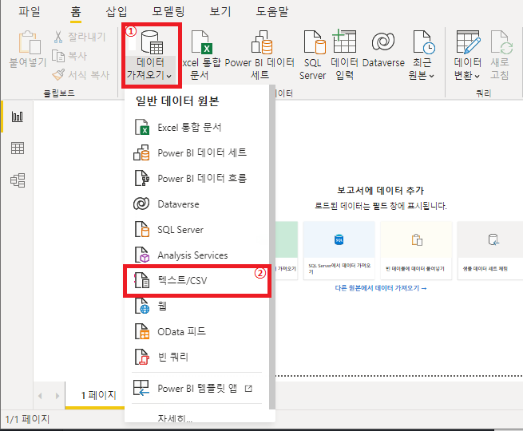
    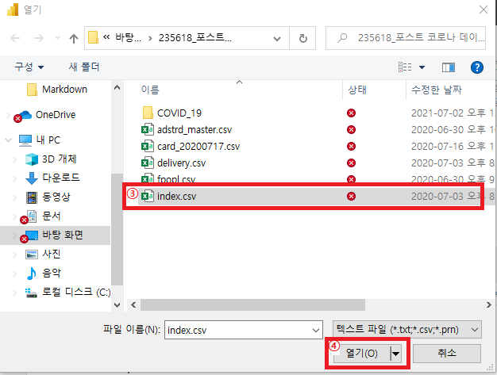
    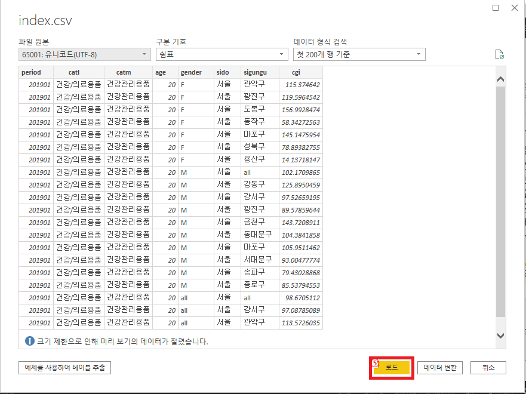

  
  ## csv 데이터 전처리
   
  - 새 열 만들기
    1. 데이터 창으로 이동
    2. 새 열 추가
  
    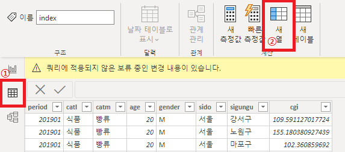 
    
    3. 새 열의 값을 생성하기위해 컬럼명 클릭
    4. 값을 생성하기 위한 해당하는 함수를 입력  
    
    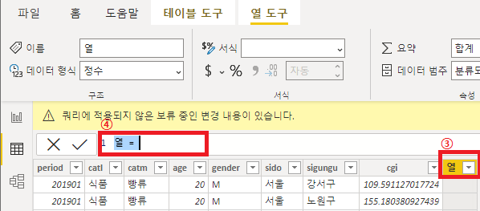
  
  
  - 새 열의 값 생성하기 (**④**에 입력)
    * year 열
  
          year = LEFT([period, 4])
    
    * momth 열
          
          month = RIGHT([period], 2) 
  
    * day 열
      
          day = [year]&"-"&[month]
      
        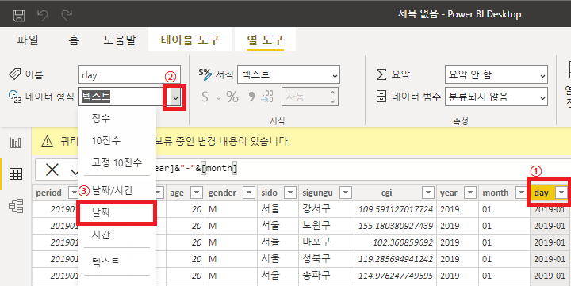

    
    * rising_falling 열
      
          rising_falling = IF([cgi] > 100, rising, falling)
          
    * rising 열
        
          rising = IF([rising_falling] = "rising", 1, 0)
          
    * falling 열
    
          falling = IF([rising_falling] = "falling", 1, 0)
    
  
  ## 지도 데이터 가져오기
  [지도 데이터](http://data.nsdi.go.kr/dataset/15144) 다운로드

  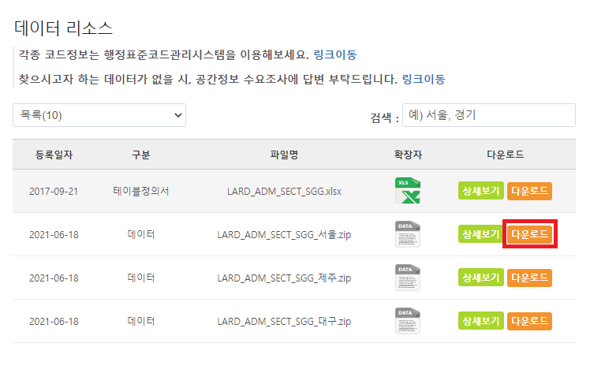

  
  ## 지도 데이터 전처리
  
  - 지도 데이터 [QGIS](../QGIS/qgis_tutorial.md)로 불러오기
    - 레이어 -> 레이어 추가 -> 벡터 레이어 추가
      
      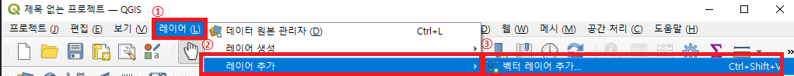

      
    - 지도 파일 열기
    
      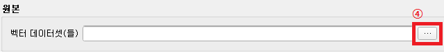
      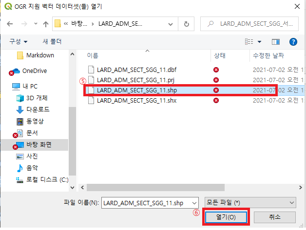
      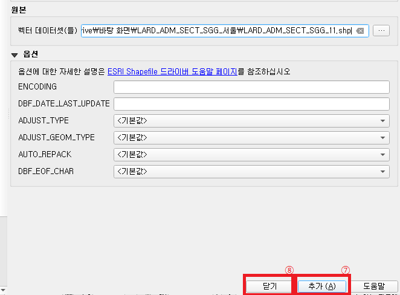
  
    
  - csv에 있는 값과 매칭하기 위해 값 수정하기
    - 속성 테이블 열기
      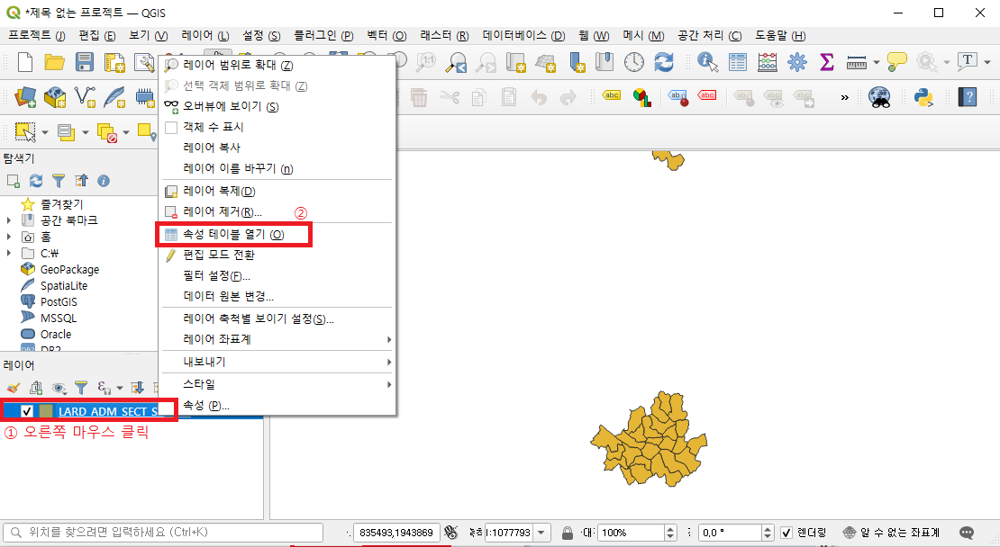
    - 수정할 행 선택 및 수정 창 열기  
      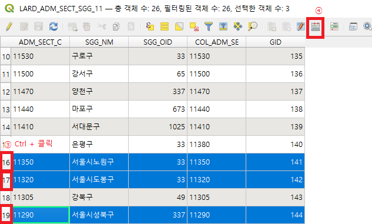

    - 수정하기
        1. 기존 필드를 갱신 선택
        2. SGG_NM 선택
        3. 문자열 -> right 더블 클릭
        4. 필드와 값 -> SGG_NM 더블 클릭
        5. `right("SGG_NM", 3)` 코드 작성
        6. 확인
  
      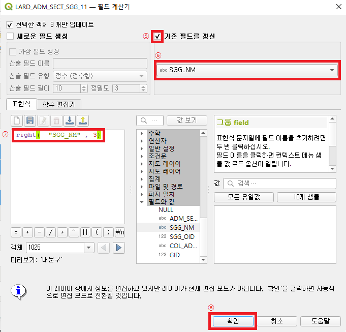
      
  - 오류 데이터 삭제
    1. GID가 253인 서초구 **이외**의 행을 모두 선택
    2. 속성 테이블 끄기
    3. 아래의 사진과 같이 오류 데이터와 일반 데이터의 색깔이 다르지 않으면 1번부터 다시
      
  
  - 전처리 완료한 데이터를 저장하기  
    1. 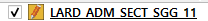 오른쪽 클릭 -> 내보내기 -> 선택한 객체 다른 이름으로 저장
    2. 포멧(a) -> ESRI shapefile 선택
    3. (b)를 선택하여 위치와 파일명(명칭_좌표계번호) 지정
    4. (c)로 좌표계를 기본 좌표(4326)으로 설정
      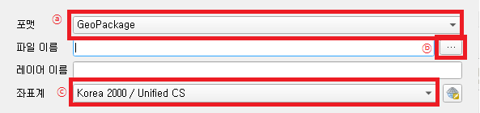
    5. 확인
    
  - 파일 형식 변경하기
    1. [mapshaper](https://mapshaper.org/)에 접속
    2. 저장한 5개의 파일을 Drag & Drop -> Import
    3. Export
    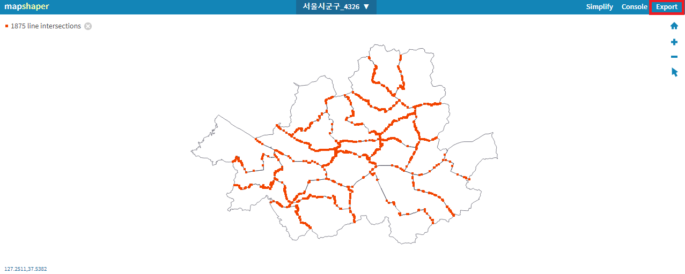
    4. TopoJSON 선택 -> Export
    
# 시각화

- 설정
  1. 파일 -> 옵션 및 설정 -> 옵션 -> 미리 보기 기능
  2. 도형 맵 시각화 체크 -> 확인
  3. Power BI restart ->  유무 확인
  
## 모형 맵Model Map
  - 설정
    1. 위치에 sigungu 데이터 필드 추가
    2. 색 채도에 cgi 데이터 필드 추가
    3. 서식 -> 도형 -> 맵 추가 -> QGIS를 통해 전처리한 JSON 지도 데이터 불러오기
  
    
    
  - 서식 바꾸기
    1. 데이터 색 -> 분기 설정으로 변경
    2. 최소값 - 빨강, 가운데 - 햐양 변경
    
    
    
  
  
    
    
    
  
  
  
