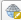

# QGIS Tutorial
  인프런의 Dee강사님의 [[입문자를 위한]QGIS로 시작하는 데이터 시각화](https://www.inflearn.com/course/qgis-%EB%8D%B0%EC%9D%B4%ED%84%B0-%EC%8B%9C%EA%B0%81%ED%99%94/dashboard)를 보고 정리한 내용입니다.

# 목차

# QGIS 란?
  데이터 뷰, 편집, 분석을 제공하는 크로스 플랫폼 자유-오픈 소스 데스크톱 지리 정보 체계(GIS) 응용 프로그램

# QGIS 시작하기
  [QGIS 다운로드 사이트](https://qgis.org/en/site/forusers/download.html)에서 설치
  
#  기초 데이터 불러오기 및 좌표 설정
  ## 데이터 다운로드
  - 강의의 1강 강의자료를 다운로드
  - [대구시 읍면동](http://data.nsdi.go.kr/dataset/15145) 파일 다운로드
    
  ## 데이터 불러오기
  - 구분자로 분리된 텍스트 레이어(csv file) 추가
    1. 레이어 -> 레이어 추가 -> 구분자로 분리된 텍스트 레이어 추가
    2. 강의자료로 다운받은 csv파일 불러오기
    3. 도형정의 -> 도형 좌표계 버튼 클릭
    4. Korea 2000 / Unified CS 검색 -> 선택 -> 추가 -> 닫기
    
  - 벡터 레이어 추가
    1. 레이어 -> 레이어 추가 -> 벡터 레이어 추가
    2. 대구시 읍면동.shp 파일 불러오기 -> 추가 -> 닫기
  
  
    
   
    
