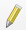
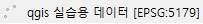

# QGIS Tutorial
  인프런의 Dee강사님의 [[입문자를 위한]QGIS로 시작하는 데이터 시각화](https://www.inflearn.com/course/qgis-%EB%8D%B0%EC%9D%B4%ED%84%B0-%EC%8B%9C%EA%B0%81%ED%99%94/dashboard)를 보고 정리한 내용입니다.

# 목차

# QGIS 란?
  데이터 뷰, 편집, 분석을 제공하는 크로스 플랫폼 자유-오픈 소스 데스크톱 지리 정보 체계(GIS) 응용 프로그램

# QGIS 시작하기
  [QGIS 다운로드 사이트](https://qgis.org/en/site/forusers/download.html)에서 설치

#  기초 데이터 불러오기 및 좌표 설정
  ## 데이터 다운로드
  - 강의의 1강 강의자료를 다운로드
  - [대구시 읍면동](http://data.nsdi.go.kr/dataset/15145) 파일 다운로드

  ## 데이터 불러오기
  - 구분자로 분리된 텍스트 레이어(csv file) 추가
    1. 레이어 -> 레이어 추가 -> 구분자로 분리된 텍스트 레이어 추가
    2. 강의자료로 다운받은 csv파일 불러오기
    3. 도형정의 -> 도형 좌표계 버튼 클릭
    4. 5179 검색 -> Korea 2000 / Unified CS 선택 -> 추가 -> 닫기

  - 벡터 레이어 추가
    1. 레이어 -> 레이어 추가 -> 벡터 레이어 추가
    2. 대구시 읍면동.shp 파일 불러오기 -> 추가 -> 닫기

  :key: 좌표계가 같아야 같이 출력된다.

  

  # 격자를 활용한 다양한 기능 및 교차 영역

  ## 필요한 데이터 전처리
  - 벡터 레이어 전처리
    1.  오른쪽 클릭
    2. 속성 테이블 열기 -> EMD_CD가 2723으로 시작되는 데이터들 선택
    3. 종료 ->  오른쪾 클릭
    4. 내보내기 -> 선택한 객체를 다른 이름으로 저장
    5. 탐색 -> 파일 이름 지정 -> 확인

  

  - 전처리된 벡터 레이어 오류 수정 방법
    1. 공간 처리 툴박스에서 무결성을 검색
    2. 전처리된 벡터 레이어를 무결성 검증
    3. 유효하지 않은 산출물 및 오류 산출물 확인  
    4. 전처리된 벡터 레이어에서 편집 모드로 전환 
    5. 꼭지점 도구(현재 레이어)
    6. 오류를 일으킨 꼭지점 Del키를 이용하여 삭제 -> 저장

  
    
  - 텍스트 레이어 전처리
    1. 벡터 -> 지리 정보 처리 도구 -> 잘라내기
    2. 입력 레이어에  선택
    3. 출력 레이어에 전처리된 벡터 레이어 선택
    4. 실행 -> 닫기

  

  ## 그리드 생성 및 격자를 활용한 기능
  - 그리드 생성
    1. 공간 처리 -> 툴박스
    2. 툴박스에서 grid 검색 -> 백터 생성 -> 그리드 생성
    3. 그리드 유형 -> 사각형(폴리곤) 선택
    4. 그리드 범위 -> 레이어에서 계산 -> 전처리된 벡터 레이어 선택
    5. 수평 간격 = 수직 간격 = 1000
    6. 실행 -> 닫기

  - 그리드 전처리
    1. 벡터 -> 지리 정보 처리 도구 -> 잘라내기
    2. 입력 레이어에  선택
    3. 출력 레이어에 전처리된 벡터 레이어 선택
    4. 실행 -> 닫기

  

  - 폴리곤에 포함하는 포인트 개수 계산 기능
    1. 툴박스에서 count 검색 -> 벡터 분석 -> 폴리곤에 포함하는 포인트 개수 계산
    2. 폴리곤 -> 전처리된 그리드 산출물[전처리된 그리드 산출물](./image/qgis_009.png)
    3. 포인트 -> 전처리된 텍스트 레이어 산출물
    4. 가중치 필드 -> TMST_00 선택 (0시 유동인구)
    5. 개수 필드 이름 -> default값인 NUMPOINTS로 설정
    6. 실행 -> 닫기
    7. 개수 산출물 -> 속성 테이블 열기 -> 생성된 열(NUMPOINTS) 확인

  

  - 교차 영역 (서로 다른 데이터를 매핑하여 새로운 열 생성)
    1. 벡터 -> 지리 정보 처리 도구 -> 교차 영역
    2. 입력 레이어 -> 전처리된 텍스트 레이어 산출물 선택
    3. 중첩 레이어 -> 전처리된 벡터 레이어 선택

  

  ## 레이어 시각화 방법 및 파일 저장

  - 그리드 레이어 시각화
    1. 개수 산출물의 속성 열기 -> 심볼 -> 단계 구분
    2. 값 -> NUMPOINTS
    3. 색상표 및 분류 개수는 원하는 것으로 변경
    4. 적용 -> 확인

  

  - 텍스트 레이어 시각화
    1. 전처리된 텍스트 레이어 산출물의 속성 열기 -> 심볼 -> 열지도
    2. 원하는 색상으로 변경
    3. 색상이 시작하는 부분을 불투명도 0%로 변경
    3. 가중치 부여 TMST_00 선택
    4. 적용 -> 확인

  

  - 파일 저장
    1. 저장하고 싶은 레이어 선택
    2. 내보내기 -> 객체를 다른 이름으로 저장
    3. 내보내고 싶은 포맷 정하기
    4. 디렉토리 선택 및 이름 설정
    5. 확인

  
